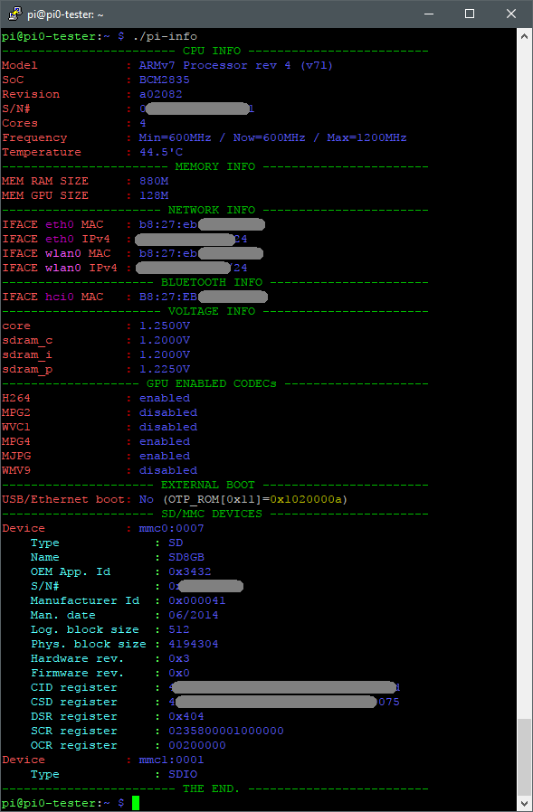

# Intro
The ```pi-info``` was created at beginning only to show MAC addresses & SN  (without the junk from ```/proc/cpuinfo``` and ```ip -4 addr show```). Eventually I added more info that can be collected :smile:
My primary objective was to **not use** any program that would user have to install, so I used what had at hand in clean **Raspbian** install (not **lite** nor **noobs** !! ).

# Script
Script uses:
- ```/proc/cpuinfo```
- ```/sys/class/net/*```
- ```/sys/bus/mmc/*```
- ```ip -4 addr show dev xxxx```
- basic linux (bash) commands available in all distros: awk, sed, cut, ls, cat, etc...

# Usage
Download the script to pi, e.g. by using wget:

```wget https://raw.githubusercontent.com/saper-2/pi-info/master/pi-info```

Next set executable bit:

```chmod +x pi-info```

And run the script:

```pi@raspberrypi:~ $ ./pi-info```

Below is a screenshot of output from PuTTY :



# End.
The end :)